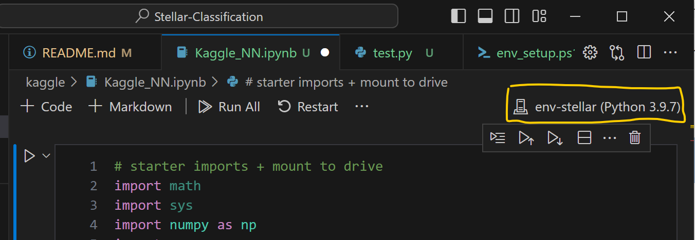

# Stellar-Classification

Repository for ENPH 479 Stellar Classification project.

## Setup

Decide where you want to clone the repository. The virtual environment folder will be created in the same location. The virtual environment is roughly **1.7 GB**.

### Windows

1. Open a command prompt and `cd` to the desired location
2. Run `git clone <repository url>`
3. Run the `env_setup.ps1` script with PowerShell. This creates and activates a new python virtual environment called `env-stellar`, and installs the required dependencies from the `requirements.txt` file.

### MacOS

**Note:** These steps are untested. Use at your own risk! If you don't trust the shell file, you can try to follow the [documentation](https://packaging.python.org/en/latest/guides/installing-using-pip-and-virtual-environments/) as needed, and research how to install the dependencies from `requirements.txt`

1. Run `git clone <repository url>` where you want to clone the repository
2. Run the `mac_env_setup.sh` script. This creates and activates a new python virtual environment called `env-stellar`, and installs the required dependencies from the `requirements.txt` file.

### Final Steps

To run notebooks correctly, we need to tell VS Code what kernel to use.

1. Open the notebook in VS Code
2. Click beside the icon that resembles a tombstone.
3. Select the complete file path to `env-stellar/Scripts/python.exe`

If you need to run python files, you may need to change the python interpreter.

1. Hit `ctrl+shift+P` to open the command palette
2. Type `python: select interpreter` and hit `Enter`
3. Select the complete file path to `env-stellar/Scripts/python.exe`

## Sources

- [Python documentation how-to on virtual environments](https://packaging.python.org/en/latest/guides/installing-using-pip-and-virtual-environments/)
- [VS Code instructions for Jupyter Notebooks](https://code.visualstudio.com/docs/datascience/jupyter-notebooks)
- [Selecting the kernel in VS Code](https://code.visualstudio.com/docs/datascience/jupyter-kernel-management#:~:text=You%20can%20open%20the%20kernel,Notebook%3A%20Select%20Notebook%20Kernel%20command.&text=Note%3A%20In%20the%20previous%20versions,all%20available%20kernels%20by%20default.)
